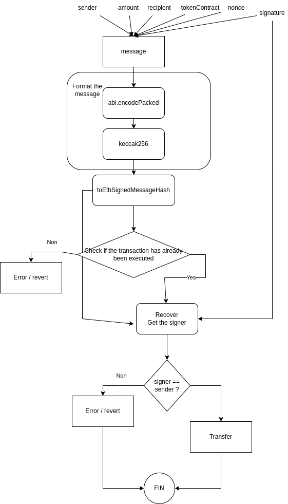

## Main point
**Actors**
- The user needs to sign messages (and not send a transaction) that contain information about the transaction they want to execute and hand it to the relayer. 
- Relayers are then responsible for creating valid transactions using this data and paying for gas themselves.
- Recipient is the target smart contract

**Gasless transfer ERC20**
 The signed message contains:
- Sender address
- Recipient address
- Amount of tokens to transfer
- TokenContract address of the ERC-20 smart contract
- A nonce to protect against replay attack

**Worflow**
1. User first approves the TokenSender contract for a define mountant of token transfers (using ERC20 approve function)
2. User signs a message containing the above information
3. Relayer calls the smart contract and passes along the signed message, and pays for gas
4. Smart contract verifies the signature and decodes the message data, and transfers the tokens from sender to recipient

**EIP-191**
This ERC proposes a specification about how to handle signed data in Ethereum contracts.
Link : [https://eips.ethereum.org/EIPS/eip-191](https://eips.ethereum.org/EIPS/eip-191)
Format of a signed message
```
"\x19Ethereum Signed Message:\n" + len(message) + message)
```
Interesting topic : [https://forum.openzeppelin.com/t/help-understanding-toethsignedmessagehash-recover/20069/3](http://)

**ECDSA**
ECDSA => Elliptic Curve Digital Signature Algorithm

**toEthSignedMessageHash()**
Returns an Ethereum Signed Message, created from s. This produces hash corresponding to the one signed with the eth_sign JSON-RPC method as part of EIP-191.
Reference :
* https://docs.openzeppelin.com/contracts/4.x/utilities
* https://docs.openzeppelin.com/contracts/4.x/api/utils#ECDSA-toEthSignedMessageHash-bytes32-

## Workflow


## Hardhat Project
Some hardhat command
```shell
npx hardhat help
npx hardhat test
REPORT_GAS=true npx hardhat test
npx hardhat node
npx hardhat run scripts/deploy.js
```
